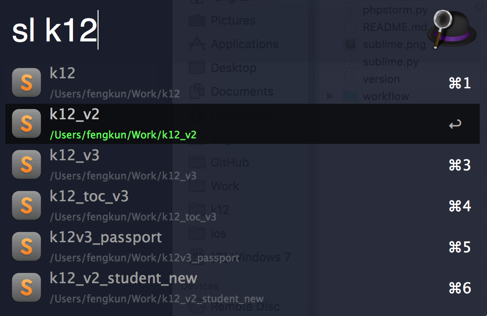
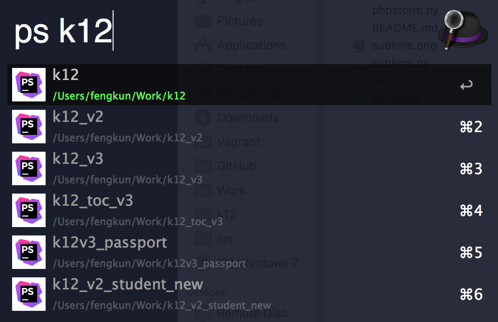

##Alfred2 workflow to open current projects in Sublime/PhpStorm

## Usage
1. Open the workflow in Finder
2. Add you Main project directory to the config.json file
3. Keyword sl {project} / Keyword ps {project}

